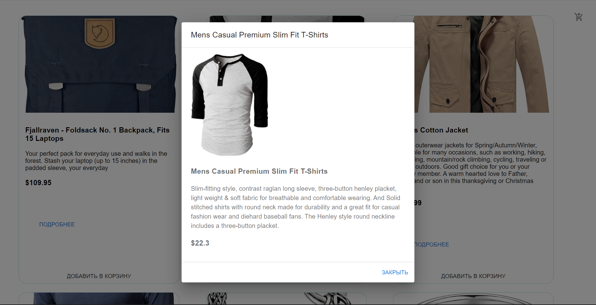

# **Shopping-Cart(React/Typescript)**

Это мой сольный учебный проект для освоения языка Typescript.

## **Функционал приложения.**

- Добавление товара в корзину  
- Открытие модального окна при клике на кнопку подробнее. 
- Отображение на иконке Корзины количество добавленного товара  
- Боковое выезжающее, анимированное окно при клике на иконку Корзины.   
- Возможность умножать или убавлять добавленный товар в зависимости от желаний посетителя.   
  - Возможность видеть во сколько раз умножиться стоимость товара в зависимости
  от количества выбранного товара(или же умноженного товара).   

## **Запуск проекта.**

Для запуска проекта вам необходимо набрать команду в терминале:  

- npm start

### **Технологии проекта**

_______________________________________________________________________________

Создал React-приложение project-recipes.
Из проекта удалил лишние файлы и создал нужные для начала работы компоненты.
Установил следующие библиотеки в зависимости:
- Material UI
- Styled-Components
- Prettier
 и многие другие.

